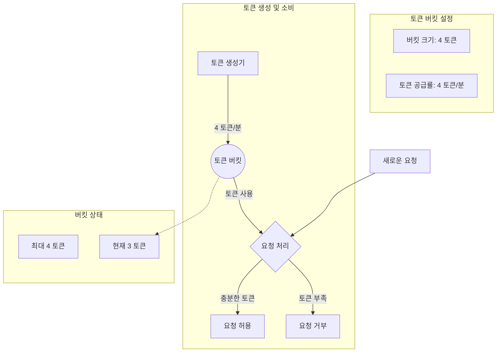
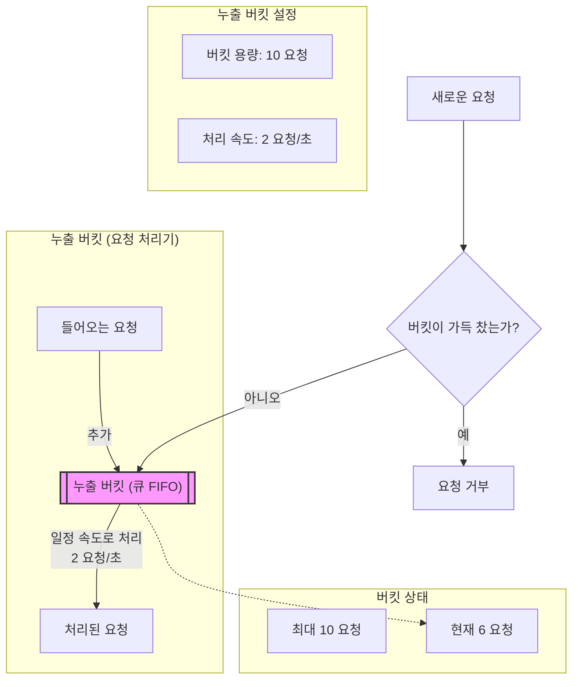
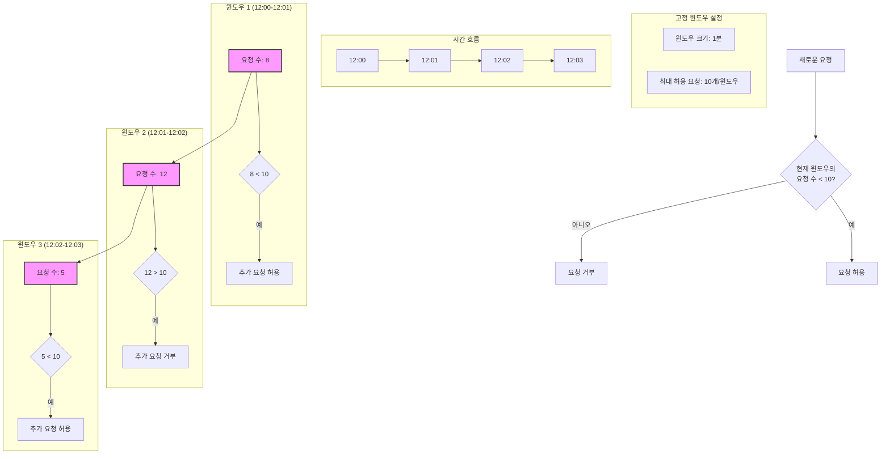
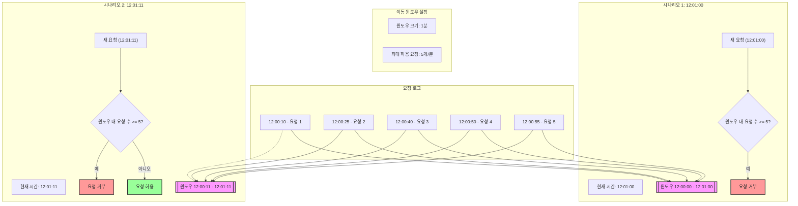
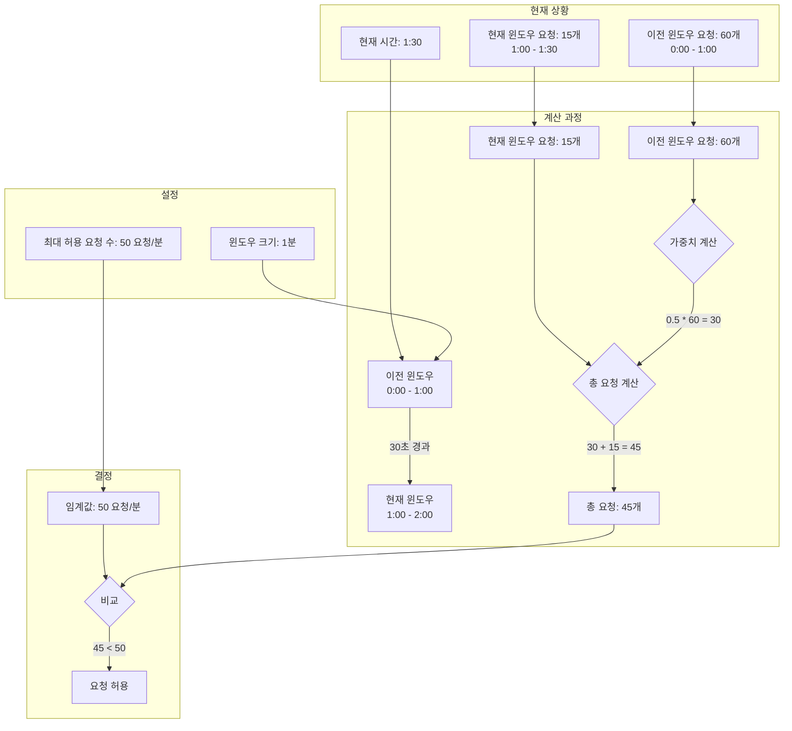

# 처리율 제한 장치의 설계

- DoS 공격에 의한 자원 고갈을 방지할 수 있다.
- 비용 절감
- 서버 과부하 방지

## 1단계 문제 이해 및 설계 범위 확정

- 처리율 제한 장치를 구현하는 데는 여러 알고리즘을 사용할 수 있다.
- 면접관과 소통을 통해 어떤 제한 장치를 구현해야하는지 명확화하자

## 2단계 개략적 설계안 제시 및 동의 구하기

- 클라이언트 요청은 쉽게 위변조가 가능하기에 서버에 제한 장치를 두는 것이 유리
- 처리율 서버 장치를 API 서버에 두는 대신, 처리율 제한 미들웨어로 처리할 수 있다.
- 클라우드 마이크로서비스의 경우 보통 API 게이트웨이에 구현된다.

  - 처리율 제한
  - SSL 종단
  - 사용자 인증
  - IP 허용 목록 관리

- 처리율 제한 장치를 어디에 둘 것인가를 결정할 때 고려해야할 점
  - 프로그래밍 언어, 캐시 서비스 등 기술 스택 점검 → 현재 서버 측 언어를 통해 구현이 가능한가? 충분한가?
  - 현재 비즈니스에 맞는 처리율 제한 알고리즘 찾기 → 미들웨어 및 제 3자가 서비스하는 Gateway를 사용한다면 선택지는 제한 될 수 있음
  - MSA 구조를 사용하고 있어 이미 API Gateway 사용하고 있다면, 기존 API Gateway에 Rate limiter 포함시키는 것 고려

### 처리율 제한 알고리즘

#### 토큰 버킷 알고리즘

- 토큰이 충분하면 요청 전달, 토큰이 없으면 요청 제한
- 토큰 버킷 알고리즘은 2개의 인자를 받는다.
  - 버킷 크기
  - 토큰 공급률
- 통상적으로 API 엔드포인트마다 버킷을 둔다
- IP 주소별로 처리율 제한을 적용해야 한다면 IP주소마다 버킷 할당
- 초당 요청 제한일 경우 모든 요청이 하나의 버킷 공유

장점

- 구현이 쉽다
- 메모리 사용 측면에서 효율적
- 짧은 시간에 집중되는 트래픽 처리 가능
  단점
- 버킷 크기와 토큰 공급률 값을 적절하게 튜닝하는 것이 까다롭다

#### 누출 버킷 알고리즘

- 토큰 버킷 알고리즘과 비슷하지만 요청 처리율이 고정되어 있다는 점이 다르다.
- 누출 버킷 알고리즘은 보통 큐로 구현
- 큐가 비어있으면 추가, 가득 찬 경우 새 요청 버림, 지정된 시간마다 큐에서 요청을 꺼내어 처리
- 누출 버킷 알고리즘 인자
  - 버킷 크기 - 큐 사이즈
  - 처리율 - 지정된 시간 당 몇 개의 항목을 처리할 것인지

장점

- 큐의 크기가 제한되어 메모리 효율적
- 고정 처리율이 있기에 안정적 출력이 필요한 경우에 적합
  단점
- 단시간에 트래픽이 몰리는 경우 최신 요청들은 버려진다
- 버킷 크기와 처리율 튜닝이 까다롭다

#### 고정 윈도 카운터 알고리즘

- 타임라인을 고정된 간격의 윈도로 나누고, 각 윈도마다 카운터를 붙인다

장점

- 메모리 효율
- 이해하기 쉽다
- 특정한 트래픽 패턴을 처리하기에 적합
  단점
- 윈도 경계 부근에 트래픽이 몰려드는 경우, 기대했던 시스템 처리 한도보다 많은 양의 요청을 처리하게 된다.

#### 이동 윈도 로깅 알고리즘

- 고정 윈도의 윈도 경계 부근 트래픽 단점을 해결한다.
- 요청의 타임스탬프를 보관
  장점
- 허용되는 요청의 개수는 시스템의 처리율 한도를 넘지 않는다
  단점
- 다량의 메모리 사용(거부된 요청의 타임스탬프도 보관)

#### 이동 윈도 카운터 알고리즘

- 고정 윈도와 이동 윈도 로킹을 결합한 알고리즘
- 이전 윈도의 가중치를 계산해 요청

장점

- 짧은 시간에 몰리는 트래픽도 대응 가능
- 메모리 효율

단점

- 직전 시간대의 요청이 균등하게 분포되어있음을 가정하기에 다소 느슨

### 개략적인 아키텍처

- 요청을 체크 하는 카운터를 어디에 보관할 것인가?
  - 데이터베이스는 디스크 접근 때문에 느려 안된다
  - 메모리상에서 동작하는 캐시가 바람직 - 빠르고 시간에 기반한 만료 정책 지원

## 3단계 상세 설계

- 처리율 제한 규칙은 어떻게 만들어지고 어디에 저장되는가?
- 처리가 제한된 요청들은 어떻게 처리되는가?

### 처리율 한도 초과 트래픽의 처리

- HTTP 429 응답(Too many requests)
- 경우에 따라 한도 제한이 걸린 메시지를 나중 처리를 위해 큐에 보관
- 처리율 제한 장치가 사용하는 HTTP Header
  - X-Ratelimit-Remaining: 윈도 내 남은 처리가능 요청 수
  - X-Ratelimit-Limit: 매 윈도마다 클라이언트가 전송할 수 있는 요청의 수
  - X-Ratelimit-Retry-After: 한도 제한에 걸리지 않으려면 몇 초 뒤에 요청을 보내야하는 지 알림

### 분산 환경에서의 처리율 제한 장치의 구현

#### 경쟁 조건 (race condition)

- 먼저 들어온 요청이 처리되기 전 새 요청이 read 할 경우
- 가장 널리 알려진 해결책은 lock이지만 성능을 저하하는 문제가 있다.
- 루아 스크립트, 정렬 집합이라 불리는 레디스 자료구조로 해결 할 수 있다.

#### 동기화 (synchronization)

- 고정 세션을 활용해 동일 클라이언트 요청은 동일 처리율 제한 장치로 보낼 수 있지만 규모 확장이 불가하고 유연하지 않다
- 레디스 같은 중앙 집중형 데이터 저장소를 쓰는 것을 추천

#### 성능 최적화

- 에지 서버를 사용해 레이턴시를 줄인다.
- 제한 장치 간 데이터를 동기화할 때 최종 일관성 모델을 사용한다.

## 4단계 마무리

- 경성 또는 연성 처리율 제한

  - 경성(Hard): 요청의 개수는 임계치를 절대 넘을 수 없음.
  - 연성(Soft): 요청의 개수는 잠시동안 임계치를 넘을 수 있음.

- 다양한 계층 처리율 제한

- 처리율 제한 회피 방법? 클라이언트 설계 방법?
  - 캐시를 사용해 API 호출 횟수를 줄임
  - 클라이언트가 처리율 제한 임계치 이해
  - 처리율 제한이 되었을 때, 클라이언트 Gracefully 복구 고려
  - Retry 로직 → 충분한 back-off
