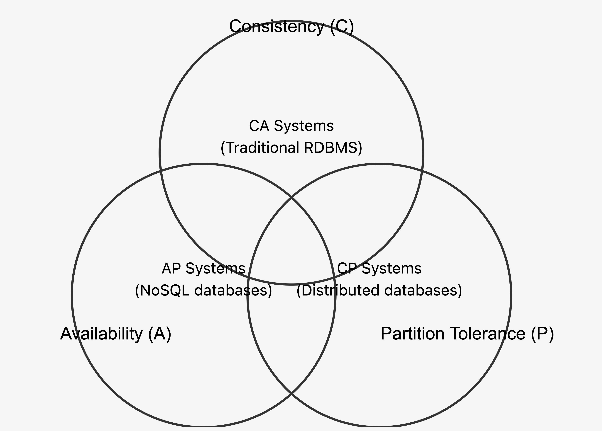

# 키 값 저장소 설계

- 키 값 저장소는 키-값 데이터베이스라고 불리는 비 관계형 데이터베이스다.
- put(key, value): 키-값 쌍을 저장소에 저장한다.
- get(key): 인자로 주어진 키에 매달린 값을 꺼낸다.

## 문제 이해 및 설계 범위 확정

- 읽기, 쓰기, 메모리 사용량 사이에 균형을 찾고, 일관성과 가용성 사이에 타협적 결정을 내린 설계면 쓸만한 답안
- 키-값 쌍의 크기는 10KB 이하
- 큰 데이터를 저장할 수 있어야 한다
- 높은 가용성 제공
- 높은 규모 확정성 제공
- 데이터의 일관성 수준은 조정이 가능해야함
- 응답 지연시간이 짧아야 한다

## 단일 서버 키-값 저장소

- 한 대 서버만 사용하는 키-값 저장소를 설계하기는 쉽다. 모두 메모리에 해시 테이블로 저장하면 된다
- 데이터 압축, 자주 쓰이는 데이터만 메모리에 두고 나머지는 디스크에 저장 등으로 개선 가능하지만 한 대 서버이기에 한계가 있다.

## 분산 키-값 저장소

- 분산 해시 테이블이라고도 함

### CAP 정리

- 일관성(consistency), 가용성(availability), 파티션 감내(partition tolerance)
  - 일관성 - 분산 시스템에 접속하는 모든 클라이언트는 어떤 노드에 접속했느냐에 관계 없이 언제나 같은 데이터를 봐야 한다.
  - 가용성 - 분산 시스템에 접속하는 클라이언트는 일부 노드에 장애가 발생하더라도 항상 응답을 받을 수 있어야 한다.
  - 파티션 감내 - 두 노드 사이에 통신 장애가 발생해도 시스템은 계속 동작되어야 한다.

- CAP 정리는 어떤 두 가지를 충족하려면 나머지 하나는 반드시 희생되어햐 함을 의미
  - CP시스템 - 일관성과 파티션 감내를 지원하는 키-값 저장소
  - AP시스템 - 가용성과 파티션 감내를 지원하는 키-값 저장소
  - CA시스템 - 일관성과 가용성을 지원하는 키-값 저장소, 네트워크 장애는 피할수 없기에 실세계에 존재하지 않음

### 실세계의 분산 시스템

- 파티션 문제가 발생하면 일관성과 가용성 사이에서 하나를 선택해야 한다.
- 일관성을 선택한다면 데이터 불일치를 피하기 위해 정상적인 노드들의 쓰기 연산을 중단해야한다.
  - 은행권 시스템에서 주로 사용
- 가용성을 선택한다면 낡은 데이터를 반환할 위험이 있더라도 읽기 연산 허용 후 파티션 문제 해결 후 새 데이터를 전송

### 시스템 컴포넌트

#### 데이터 파티션

- 데이터를 여러 서버에 고르게 분산할 수 있는가?
- 노드가 추가되거나 삭제될 때 데이터의 이동을 최소화 할 수 있는가?

장점

- 규모 확장 자동화
- 다양성

#### 데이터 다중화

- 높은 가용성과 안정성 확보를 위해서는 데이터를 N개 서버에 비동기적으로 다중화 필요
- 시계 방향으로 순회하며 만나는 첫 N개 서버에 사본 저장
- 가상 노드 사용시 선택된 N개의 노드가 실제 물리 서버의 개수가 다를 수 있음

#### 일관성

- 여러 노드에 다중화된 데이터는 적절히 동기화가 되어야 한다.
- 정족수 합의 프로토콜로 읽기/쓰기 연산 모두에 일관성을 보장할 수 있다.
- W(쓰기 연산 정족수), R(읽기 연산 정족수), N(사본 개수)의 값을 정하는 것은 응답 지연과 데이터 일관성 사이의 타협점을 찾는 과정
- 정족수가 작을 수록 속도가 빠르지만 일관성 수준은 떨어진다. 반대로 정족수 수가 많으면 일관성 수즌은 높아지지만 속도가 느려진다.
  - R = 1, W = N: 빠른 읽기 연산에 최적화
  - W = 1, R = N: 빠른 쓰기 연산에 최적화
  - W + R > N: 강한 일관성 보장
  - W + R <= N: 강한 일관성 보장되지 않음
- 최종 일관성 - 약한 일관성의 한 형태로, 갱신 결과가 모든 사본에 반영(동기화)되는 모델

#### 일관성 불일치 해소: 데이터 버저닝

- 버저닝과 벡터 시계
- 벡터 시계는 [서버, 버전]의 순서쌍을 데이터에 매단 것
- 어떤 버전 X, Y가 있을 때 Y의 벡터 시계 구성요소 가운데 X의 벡터 시계 구성요소보다 작은 값을 가지는 경우있다면 충돌로 판단

단점

- 충돌 감지 및 해소 로직이 클라이언트에 필요하기에, 클라이언트 구현이 복잡
- [서버, 버전]의 순서쌍 개수가 빠르게 늘어난다. 임계치를 정한 후 오래된 순서쌍을 제거해야함

#### 장애 처리

징에 김지

- 분산 시스템에서는 두 대 이상의 서버가 특정 서버의 장애를 보고해야 실제로 장애가 발생했다고 간주
- 모든 노드 사이에 멀티캐스팅 채널을 구축하는 것이 서버 장애를 감지하는 손 쉬운 방법이나 서버가 많을 경우 비효율적
- 가십 프로토콜 같은 분산형 장애 감지 솔루션을 채택하는 편이 보다 효율적

일시적 장애 처리

- 가십 프로토콜로 장애를 감지한 시스템은 가용성 보장을 위해 필요한 조치를 해야한다.
- 엄격한 정족수 접근법이면 읽기와 쓰기 연산을 금지
- 느슨한 정족수 접근법이면 건강한 서버를 해시 링에서 골라 요구사항을 수행 후 장애 서버 복구 후 일괄 반영하여 데이터 일관성을 보존
- 임시 위탁 기법 - 임시로 쓰기 연산을 처리한 서버에 그에 관한 힌트를 남겨둔다.

영구 장애 처리

- 반-엔트로피 프로토콜을 구현하여 사본들의 동기화가 필요
- 사본 간의 일관성이 망가진 상태를 탐지하고 전송 데이터의 양을 줄이기 위해서는 머클 트리를 사용
- 머클 트리 비교는 루트 노드의 해시값이 일치한다면 두 서버는 같은 데이터를 갖는 것
- 트리 비교를 하며 다른 데이터를 가진 버킷만 동기화
- 머클 트리를 사용하면 동기화해야하는 데이터의 양은 실제로 존재하는 차이의 크기에 비례할 뿐, 두 서버에 보관된 데이터의 총량과는 무관해진다.

#### 시스템 아키텍처 다이어그램

- 클라이언트는 키-값 저장소가 제공하는 get, put으로 통신
- 중재자는 클라이언트에게 키-값 저장소에 대한 프락시 역할을 하는 노드다
- 노드는 안정 해시의 해시 링 위에 분포한다
- 노드를 자동으로 추가 또는 삭제할 수 있도록, 시스템은 완전히 분산된다
- 데이터는 여러 노드에 다중화된다
- SPOF는 존재 하지 않는다.

#### 쓰기 경로

1. 쓰기 요청이 커밋 로그 파일에 기록
2. 데이터가 메모리 캐시에 기록
3. 메모리 캐시가 가득차거나 임계치에 도달하면 디스크에 있는 SSTable에 기록

#### 읽기 경로

1. 데이터가 메모리에 있는지 검사
2. 데이터가 메모리에 없으면 블룸 필터를 검사
3. 블룸 필터를 통해 어떤 SSTable에 키가 보관되어 있는지 확인
4. SSTable에서 데이터를 가져온다
5. 해당 데이터를 클라이언트에 반환
